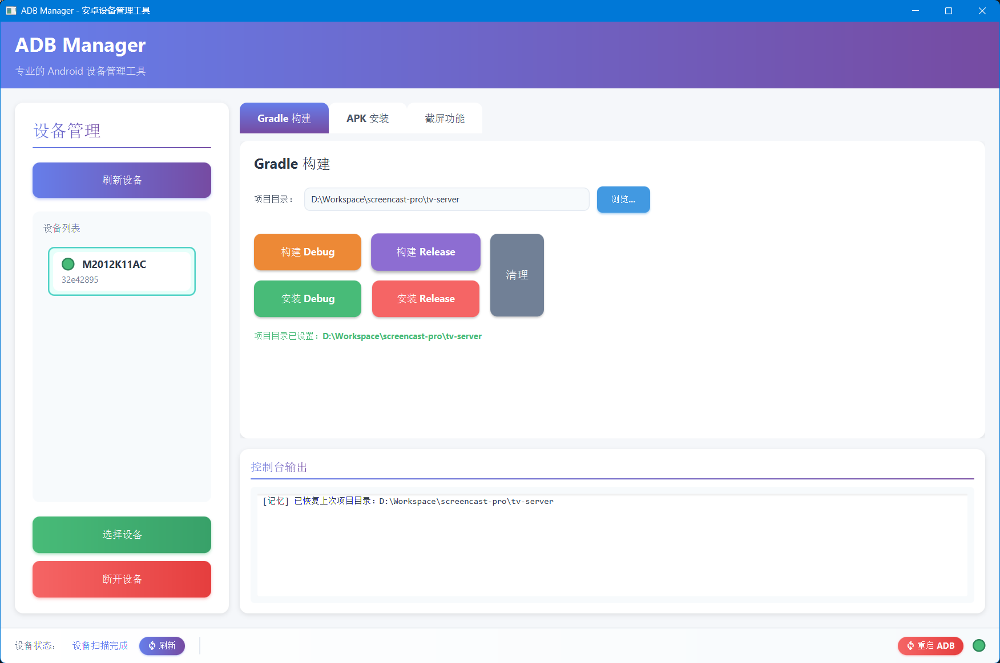

# ADB Manager

<p align="center">
  
  
  
  
</p>

<p align="center">
  <b>一款现代化的 Android 设备管理工具</b><br>
  <span style="color: #666">基于 JavaFX 开发的图形化 ADB 管理界面</span>
</p>

---

## 功能特性

<table>
<tr>
<td width="50%">

### 📱 设备管理
- 自动扫描连接的 Android 设备
- 显示设备型号和序列号
- 支持设备选择和断开
- 实时状态指示器

</td>
<td width="50%">

### 🔨 Gradle 构建
- 选择 Android 项目目录
- 一键构建 Debug/Release
- 直接安装到设备
- 实时构建状态显示

</td>
</tr>
<tr>
<td width="50%">

### 📦 APK 安装
- 自动扫描项目 APK
- 智能识别版本类型
- 直接浏览选择 APK
- 证书问题自动检测

</td>
<td width="50%">

### 📸 截屏功能
- 自定义输出目录
- 自定义文件名格式
- 自动生成时间戳
- 一键截屏保存

</td>
</tr>
<tr>
<td width="50%">

### 📂 文件管理
- 电脑与手机双向传输
- 支持推送/拉取文件
- 手机端文件操作（删除、重命名、新建文件夹）
- 目录浏览记忆功能

</td>
</tr>
</table>

---

## 界面预览

<p align="center">
  
</p>

> 浅色系主题设计，紫色渐变主色调，现代化卡片式布局

- **圆角设计**：8-12px 圆角卡片
- **渐变色彩**：#667eea → #764ba2 紫色渐变
- **平滑动画**：按钮悬停和点击效果
- **清晰层次**：功能分区明确

---

## 快速开始

### 环境要求

| 工具 | 版本要求 | 验证命令 |
|------|----------|----------|
| Java | 17+ | `java -version` |
| Maven | 3.6+ | `mvn -version` |
| ADB | 最新版 | `adb version` |
| Gradle | 7.0+ | `gradle -v` |

### 编译运行

#### 使用 Maven 命令

```cmd
# 编译并运行
mvn javafx:run

# 仅编译（生成 JAR）
mvn clean package

# 编译生成可执行 EXE（需要使用 run.bat 菜单）
```

#### 使用启动菜单

双击 `run.bat` 启动菜单：

```
========================================
  ADB Manager - Android Device Tool
========================================

  [1] Build and Run (First Time)
  [2] Build Only
  [3] Run EXE (After Build)
  [4] Exit

========================================

Please select an option (1-4):
```

**菜单选项说明：**
- `[1] Build and Run` - 编译并生成 EXE，然后运行（首次使用选这个）
- `[2] Build Only` - 仅编译生成 EXE
- `[3] Run EXE` - 直接运行已生成的 EXE 文件
- `[4] Exit` - 退出菜单

程序启动后会提示：
```
[1] Return to menu
[2] Exit
```
可以选择返回菜单继续操作，或彻底退出。

### 生成的文件

编译完成后，`target/` 目录下会生成：

```
target/
├── ADBManager.exe          # 可执行文件（双击直接运行）
├── adb-manager-1.0.0.jar    # JAR 包
└── lib/                     # 依赖库
    ├── javafx-*.jar
    ├── gson-*.jar
    └── ...
```

**日常使用**：直接双击 `target\ADBManager.exe` 即可运行，无需再打开菜单。

---

## 使用指南

### 1. 连接设备

1. 使用 USB 连接 Android 设备
2. 在设备上启用 **开发者选项** 和 **USB 调试**
3. 首次连接需要在手机上授权
4. 点击左侧 **刷新设备** 按钮
5. 从列表中选择要操作的设备

### 2. Gradle 构建

1. 切换到 **Gradle 构建** 标签页
2. 点击 **浏览** 选择 Android 项目根目录
3. 点击相应按钮执行构建或安装

### 3. APK 安装

1. 切换到 **APK 安装** 标签页
2. 点击 **刷新 APK 列表** 从当前项目查找
3. 或点击 **浏览** 直接选择 APK 文件
4. 点击 **安装** 按钮安装到选中的设备

### 4. 截屏功能

1. 切换到 **截屏功能** 标签页
2. 点击 **浏览** 选择截屏保存目录
3. 设置文件名前缀和后缀（可选）
4. 点击 **开始截屏** 按钮

---

## 项目结构

```
AndroidTools/
├── pom.xml                          # Maven 配置
├── run.bat                          # 启动菜单脚本
├── README.md                        # 项目说明
└── src/
    └── main/
        ├── java/com/androidtools/adbmanager/
        │   ├── AdbManagerApp.java          # 主程序入口
        │   ├── manager/
        │   │   ├── AdbManager.java         # ADB 命令管理
        │   │   ├── DeviceManager.java      # 设备管理
        │   │   └── GradleManager.java      # Gradle 构建
        │   ├── ui/
        │   │   ├── MainLayout.java         # 主界面布局
        │   │   ├── DevicePanel.java        # 设备管理面板
        │   │   ├── GradlePanel.java        # Gradle 构建面板
        │   │   ├── ApkInstallPanel.java    # APK 安装面板
        │   │   ├── ScreenshotPanel.java    # 截屏面板
        │   │   ├── ConsolePanel.java       # 控制台面板
        │   │   └── CircleIndicator.java    # 圆形指示器
        │   └── util/
        │       └── Constants.java          # 常量定义
        └── resources/styles/
            └── styles.css                  # 样式文件
```

---

## 设计系统

### 配色方案

| 用途 | 颜色 | 色值 |
|------|------|------|
| 主色 | 紫色渐变 | `#667eea` → `#764ba2` |
| 成功 | 绿色 | `#48bb78` |
| 危险 | 红色 | `#f56565` |
| 警告 | 橙色 | `#ed8936` |
| 信息 | 蓝色 | `#4299e1` |
| 背景 | 浅灰 | `#f5f7fa` |
| 卡片 | 白色 | `#ffffff` |
| 文字 | 深灰 | `#2d3748` |

### 技术栈

- **UI 框架**: JavaFX 19
- **构建工具**: Maven
- **样式**: CSS3
- **JDK**: OpenJDK 17+

---

## 常见问题

### 程序无法启动

```cmd
# 检查 Java 版本
java -version

# 使用菜单选项 [3] Build Only 重新编译
# 或使用菜单选项 [2] Build and Run 编译并运行
```

### 找不到设备

1. 检查 USB 连接是否正常
2. 确认已开启 USB 调试
3. 检查 ADB 是否已添加到 PATH
4. 尝试重新插拔设备

### 安装失败（证书问题）

程序会自动检测证书签名问题，并提示卸载旧版本后重新安装。

---

## 配置说明

配置文件位置：`~/.adb-manager/config.properties`

```properties
# APK 输出目录
apk.output.dir=/path/to/apk/output

# APK 文件路径
apk.file.path=/path/to/apk/file.apk

# 项目目录
project.dir=/path/to/android/project

# 截屏保存目录
screenshot.dir=/path/to/screenshots
```

---

## 开源协议

MIT License

---

<p align="center">
  Made with ❤️ for Android Developers
</p>
